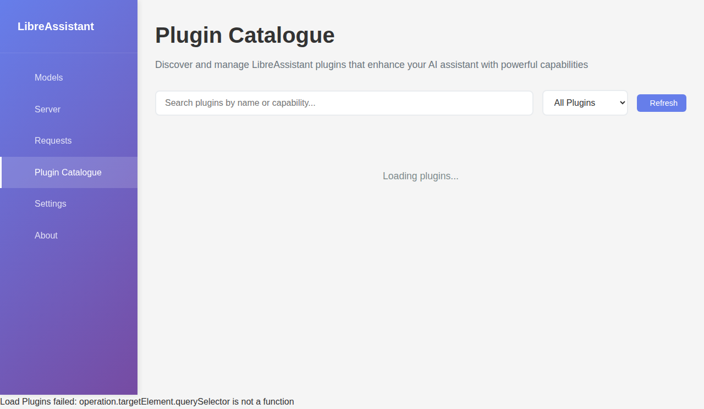

# LibreAssistant


**LibreAssistant** is a privacy-first, fully local AI assistant and plugin platform. It combines robust Ollama model management and chat features with a modern, extensible plugin system (MCP servers). LibreAssistant is the evolution of **my-ollama-wrapper**—all legacy model management features are preserved, and powerful new plugin capabilities are added.

---

## 🚀 What’s New in LibreAssistant

- **Plugin System (MCP Servers):** Run first- and third-party plugins as secure, isolated microservices. Extend LibreAssistant with new capabilities—search, file I/O, legal research, and more.
- **Plugin Catalogue & Management UI:** Browse, enable/disable, and configure plugins with a single click. No technical knowledge required.
- **Real-Time Plugin Activity Bar:** See which plugins are active for each request, with live visualization and clickable plugin pills for logs/details.
- **Legacy Model Management:** All Ollama model management, chat, and troubleshooting features from my-ollama-wrapper are fully supported.
- **First-Party Plugins:** Includes Local File I/O, CourtListener, Brave Search, and a test plugin for development.

---

## 📸 Screenshots

> _If you have not yet added screenshots, place them in a `screenshots/` folder and update the links below._


_Plugin catalogue: browse, enable, and configure plugins._


_Real-time plugin activity bar and request visualization._

---

---

## Table of Contents

- [Vision & Philosophy](#libreassistant-vision--philosophy)
- [User Experience & Workflow](#user-experience--workflow)
- [Legacy Features from my-ollama-wrapper](#legacy-features-from-my-ollama-wrapper)
- [Plugin System & Management](#plugin-system--management)
- [Plugin API & MCP Server Guide](#plugin-api--mcp-server-guide)
- [Roadmap](#roadmap)
- [Installation](#installation)
- [Usage](#usage)
- [Development](#development)
- [Building](#building)
- [Contributing](#contributing)
- [Troubleshooting](#troubleshooting)
- [Roadmap](#roadmap)
- [License](#license)

---

# LibreAssistant Vision & Philosophy

**An AI Assistant That's Actually Yours.**


LibreAssistant is a privacy-first, fully local AI assistant and plugin platform. It combines robust Ollama model management and chat features with a modern, extensible plugin system (MCP servers). LibreAssistant is the evolution of **my-ollama-wrapper**—all legacy model management features are preserved, and powerful new plugin capabilities are added.
LibreAssistant is designed from the ground up to put you in control:
- **Privacy First**: All processing happens locally. Your data never leaves your device, and there is absolutely no built-in data extraction or telemetry.
- **Total Customization**: Choose any model, adjust any setting, and tailor the assistant to your exact needs.
- **Data Sovereignty**: You own your data. LibreAssistant will never collect, transmit, or share your information.


1. You submit a request: _"Find and summarize the latest Supreme Court opinions using CourtListener."_
2. LibreAssistant checks if the CourtListener plugin is enabled. If not, it prompts you to enable it (with a single click).
3. The plugin requests an API key if needed, guiding you through a simple, non-technical setup.


4. As the assistant works, you see a visual indicator showing the CourtListener plugin is active.
5. The summary is returned, and you can review which plugins were used for full transparency.
# Legacy Features from my-ollama-wrapper

- **Multiple Interfaces**: Access via web browser, Electron desktop app, or Python Flask backend.
- **Modern UI/UX**: Responsive design, theme support, and a clean, professional interface.

All legacy features are fully supported for backward compatibility and a smooth transition for users of my-ollama-wrapper. LibreAssistant adds a new plugin system for even greater extensibility.

---

# Plugin System & Management

LibreAssistant’s plugin system is built around **MCP servers**—microservice plugins that run as separate processes and communicate with the core assistant. This enables powerful, secure, and extensible automation.

---

## Plugin API & MCP Server Guide

For details on creating your own plugins, see the [PLUGIN_API.md](./PLUGIN_API.md) file. It covers the manifest format, MCP server protocol, example code, and best practices for plugin authors.

## Plugin Catalogue & Real-Time Activity

- **Browse Plugins:** Open the Plugin Catalogue from the main UI to see all available plugins, their status, and descriptions.
- **Enable/Disable:** Toggle plugins on or off with a single click. Permissions and config are managed through the UI.
- **Configure Plugins:** Set API keys, preferences, and other options directly from the plugin’s config panel.
- **Real-Time Activity Bar:** When you send a request, the activity bar shows which plugins are being used, with live updates and color-coded status.
- **Plugin Pills:** Click any plugin pill in the activity bar to view logs, details, or open a modal with more information.

## How to Enable/Disable Plugins

1. Open the Plugin Catalogue (from the sidebar or main menu).
2. Find the plugin you want to enable/disable.
3. Click the toggle switch. If permissions or config are required, you’ll be prompted.
4. The plugin’s status and activity will update in real time.

## Viewing Plugin Activity

- The activity bar at the top of the requests screen shows all plugins involved in the current or recent requests.
- Hover or click a plugin pill to see logs, errors, or details.
- All plugin actions are transparent—see exactly what each plugin accessed or modified.

---

## First-Party Plugins

| Plugin Name         | Purpose                                                      |
|--------------------|-------------------------------------------------------------|
| Local File I/O     | Securely read/write files on your device (with consent)      |
| CourtListener      | Search and retrieve legal opinions/dockets from CourtListener |
| Brave Search       | Search the web using Brave Search (privacy-respecting)        |
| Test Plugin        | Minimal plugin for development and testing                    |

### 🤖 Chat/Interaction Console
- **Model Selection**: Choose from available Ollama models
- **Chat History**: Persistent conversation history during the session
- **Real-time Responses**: Streaming responses with typing indicators
- **Error Handling**: Clear error messages and status indicators

- **Model List**: View all local Ollama models with detailed information
- **Model Metadata**: View model size, modification date, and family information
- **Error Monitor**: Comprehensive error tracking with severity levels (Critical, Error, Warning)
- **Troubleshooting Guide**: Built-in documentation for common issues and solutions
- **System Requirements**: Hardware and software requirement guidelines
- **Useful Commands**: Quick reference for Ollama commands and diagnostics

### ⚙️ Settings & Configuration
- **Ollama Server Settings**
  - Configurable server URL (supports any Ollama instance)
  - Theme selection (Light, Dark, Auto-detect)
  - Auto-connect on startup option
- **Input Validation** - Real-time validation with helpful error messages

- **Multiple Interfaces**: Web interface, Electron desktop app, and Python Flask application
- **Confirmation Dialogs**: Safe model deletion and chat clearing
- **Modern UI**: Clean, professional interface with proper styling
- **Theme Support**: Multiple themes including system preference detection

## Installation

### Prerequisites

Before you begin, ensure you have the following installed:

#### Required
- **[Ollama](https://ollama.ai/)**: Must be installed and running on your system
- **Node.js**: Version 18.0 or higher (for development and desktop app)
- **npm**: Version 8.0 or higher (comes with Node.js)

#### Recommended
- **Git**: For cloning the repository and contributing
- **Python 3.8+**: For running the Flask backend (optional)
- **VS Code**: For development (with recommended extensions)

#### System Requirements
- **OS**: Windows 10+, macOS 10.15+, or Linux (Ubuntu 18.04+)
- **RAM**: Minimum 4GB (8GB+ recommended for larger models)
- **Storage**: At least 2GB free space (more for model storage)

### Installation Options

#### Option 1: Simple Web Interface (Recommended)

Simply clone this repository and open `index.html` in any modern web browser:

```bash
git clone https://github.com/aubreyhayes47/my-ollama-wrapper.git
cd my-ollama-wrapper
# Open index.html in your browser for full functionality
# Open demo.html for demo mode without Ollama backend
```

#### Option 2: Electron Desktop Application

For a native desktop experience:

```bash
git clone https://github.com/aubreyhayes47/my-ollama-wrapper.git
cd my-ollama-wrapper
npm install
npm run electron
```

#### Option 3: Development Environment

For contributing or customizing:

```bash
git clone https://github.com/aubreyhayes47/my-ollama-wrapper.git
cd my-ollama-wrapper
npm install
npm run start
```

#### Option 4: Python Flask Application (Advanced)

For the Python backend:

```bash
git clone https://github.com/aubreyhayes47/my-ollama-wrapper.git
cd my-ollama-wrapper
pip install -r requirements.txt
python main.py
```

## Usage

### Prerequisites Setup

1. **Install Ollama**: Download and install from [https://ollama.ai](https://ollama.ai)

2. **Start Ollama service**:
   ```bash
   ollama serve
   ```

3. **Install at least one model**:
   ```bash
   # Install a lightweight model for testing
   ollama pull llama2:7b
   
   # Or install other models
   ollama pull codellama:7b
   ollama pull mistral:7b
   ```

4. **Verify Ollama is running**:
   ```bash
   # Check if Ollama is accessible
   curl http://localhost:11434/api/version
   
   # List installed models
   ollama list
   ```

### Web Interface (Recommended)

1. Open `index.html` in your web browser
2. The application will automatically detect your Ollama installation
3. Select a model from the dropdown menu
4. Start chatting with your local models!

### Desktop Application

1. Run the Electron app:
   ```bash
   npm run electron
   ```
2. Use the desktop interface for a native experience

### Python Flask Application

1. Start the Flask backend:
   ```bash
   python main.py
   ```
2. Open your browser to `http://localhost:5000`

## Building

### Web Application

#### Build for Development
```bash
npm run start
```

#### Build for Production
```bash
npm run build
```

### Desktop Application

#### Build Electron App
```bash
npm run electron-pack
```

#### For Development Testing
```bash
npm run electron-dev
```

#### Combined Development (Webpack + Electron)
```bash
npm run electron-dev-start
```

Built applications will be available in the `dist-electron/` directory.

### Python Application

The Python Flask application doesn't require building - simply run:

```bash
python main.py
```

For production deployment, consider using a WSGI server like Gunicorn:

```bash
pip install gunicorn
gunicorn main:app
```

## Development

### Getting Started

1. Fork the repository
2. Clone your fork locally
3. Install dependencies: `npm install`
4. Start development server: `npm run start`
5. Make your changes
6. Test your changes: `npm test` (when available)
7. Submit a pull request

### Available Scripts

- `npm run start` - Start development server with webpack
- `npm run build` - Build for production
- `npm run electron` - Start Electron desktop app
- `npm run electron-dev` - Start Electron in development mode
- `npm run electron-pack` - Build and package Electron app
- `npm run electron-dev-start` - Start both webpack dev server and Electron

### Project Structure

```
my-ollama-wrapper/
├── src/                    # Source code
│   ├── main/              # Electron main process
│   │   └── main.js        # Electron main entry point
│   └── renderer/          # Electron renderer process
│       ├── App.js         # Main React component
│       ├── App.css        # Component styles
│       ├── index.js       # React entry point
│       └── index.css      # Global styles
├── public/                # Static assets
│   └── index.html         # HTML template
├── dist-electron/         # Built Electron app (generated)
├── node_modules/          # Dependencies (generated)
├── chat.html              # Standalone chat interface
├── chat-script.js         # Chat functionality
├── chat-styles.css        # Chat styles
├── demo.html              # Demo interface
├── demo.js                # Demo functionality
├── index.html             # Main web interface
├── script.js              # Main application logic
├── styles.css             # Main application styles
├── cli.py                 # Command line interface
├── main.py                # Flask application entry
├── ollama_manager.py      # Ollama API management
├── ollama_wrapper.py      # Ollama wrapper functionality
├── requirements.txt       # Python dependencies
├── package.json           # Project dependencies and scripts
├── webpack.config.js      # Webpack configuration
├── CONTRIBUTING.md        # Contribution guidelines
└── README.md              # This file
```

### Key Files Explained

- **`index.html`**: Main web interface with full functionality
- **`chat.html`**: Standalone chat interface
- **`demo.html`**: Demo mode without Ollama backend
- **`src/main/main.js`**: Electron main process configuration
- **`src/renderer/`**: React components for Electron app
- **`ollama_manager.py`**: Core Python integration with Ollama API
- **`script.js`**: Main JavaScript application logic
- **`webpack.config.js`**: Build configuration for development and production

## Contributing

We welcome contributions! Please see our [CONTRIBUTING.md](./CONTRIBUTING.md) file for detailed guidelines on:

- Code of conduct
- Development workflow
- Pull request process
- Coding standards
- Testing requirements

## Troubleshooting

### Common Issues

#### Ollama Connection Issues

**Problem**: Cannot connect to Ollama service
**Solutions**:
1. Ensure Ollama is running: `ollama serve`
2. Check if Ollama is accessible: `curl http://localhost:11434/api/version`
3. Verify firewall settings allow connections to port 11434
4. Try restarting Ollama service

#### CORS Issues (Web Interface)

**Problem**: Browser blocks requests to Ollama
**Solutions**:
1. Use the demo mode (`demo.html`) for testing without Ollama
2. Run Ollama with CORS enabled: `OLLAMA_ORIGINS=* ollama serve`
3. Use the Electron desktop app instead of browser
4. Use the Python Flask backend as a proxy

#### Models Not Loading

**Problem**: Models fail to load or respond
**Solutions**:
1. Verify model is installed: `ollama list`
2. Test model directly: `ollama run <model-name>`
3. Check system resources (RAM/CPU usage)
4. Try a smaller model for testing: `ollama pull tinyllama`

#### Electron App Issues

**Problem**: Desktop app fails to start
**Solutions**:
1. Ensure Node.js 18+ is installed
2. Reinstall dependencies: `rm -rf node_modules && npm install`
3. Try running in development mode: `npm run electron-dev`
4. Check console for error messages

#### Python Flask Issues

**Problem**: Flask application fails to start
**Solutions**:
1. Install Python dependencies: `pip install -r requirements.txt`
2. Check Python version: `python --version` (3.8+ required)
3. Verify Ollama is running before starting Flask
4. Check for port conflicts (default: 5000)

### Getting Help

If you encounter issues not covered here:

1. Check the [Issues](https://github.com/aubreyhayes47/my-ollama-wrapper/issues) page
2. Search for similar problems in closed issues
3. Create a new issue with:
   - Detailed description of the problem
   - Steps to reproduce
   - System information (OS, Node.js version, etc.)
   - Error messages and logs
   - Which interface you're using (web, Electron, or Python)

# Roadmap

LibreAssistant is under active development. The immediate roadmap focuses on building a robust, user-friendly plugin system and empowering users with transparent, actionable AI tools.

**Planned Features & Milestones:**

- **Plugin System Core**: Develop the built-in plugin catalogue, one-click enable/disable, and visual plugin activity indicators.
- **Plugin Management UI**: Intuitive interface for browsing, enabling, and configuring plugins—no technical knowledge required.
- **Plugin Transparency**: Real-time visualization of which plugins are active and what data they access.

**First-Party Plugins in Development:**

1. **Local File I/O Plugin**
   - Securely read and write files on your device, with explicit user consent for each operation.
2. **CourtListener Plugin**
   - Search and retrieve legal opinions and dockets from CourtListener.
   - Simple, non-technical API key management and setup.
3. **Brave Search Plugin**
   - Search the web using Brave Search, with privacy-respecting integration.

**Future Directions:**
- More plugin types and third-party integrations
- Enhanced plugin catalogue (ratings, search, categories)
- Advanced visualizations of plugin activity
- User scripting and automation
- Accessibility and localization improvements

Contributions and feedback are welcome as LibreAssistant evolves!


## License

This project is licensed under the Apache License 2.0 - see the [LICENSE](LICENSE) file for details.
