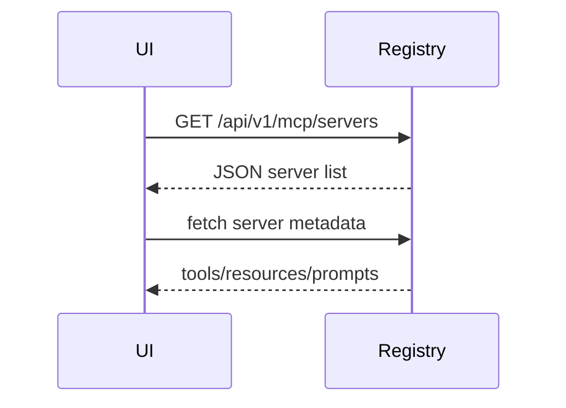

<!-- Copyright (c) 2024 LibreAssistant contributors. Licensed under the MIT License. -->

# MCP Server Manager UI

The switchboard lists discovered servers in a side panel. Each entry expands to show available tools, resources and prompts. Dangerous tools display a confirmation modal before execution. The history view includes JSON‑formatted audit entries for every call.

## Discovery Flow

When the panel opens, the UI requests the list of registered servers via [`GET /api/v1/mcp/servers`](docs/api.md#api-v1-mcp-servers). Each server entry expands to retrieve capabilities and prompt templates from the server over the MCP channel.



## Consent Prompts

Invoking a server for the first time triggers a consent modal describing the data to be shared. The UI posts the user's decision to [`POST /api/v1/mcp/consent/{name}`](docs/api.md#post-api-v1-mcp-consent-name) and reads it back with [`GET /api/v1/mcp/consent/{name}`](docs/api.md#get-api-v1-mcp-consent-name). Dangerous tools also require a secondary confirmation before calling [`POST /api/v1/invoke`](docs/api.md#post-api-v1-invoke).

```text
┌────────────────────────────┐
│ Allow "echo" server access?│
│ ┌─────────┐  ┌────────────┐ │
│ │ Allow   │  │ Decline    │ │
│ └─────────┘  └────────────┘ │
└────────────────────────────┘
```

## History Display

Every invocation is appended to the per-user log exposed by [`GET /api/v1/history/{user_id}`](docs/api.md#get-api-v1-history-user_id). The history tab renders entries as collapsible JSON blocks with timestamps for auditing.

```text
┌────────────────────────────────────────────┐
│ 2024-04-09T12:00Z invoke echo              │
│ { "input": "hello", "output": "hello" }    │
└────────────────────────────────────────────┘
```
